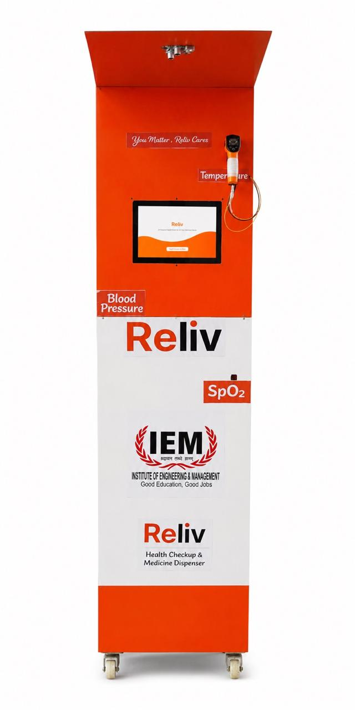
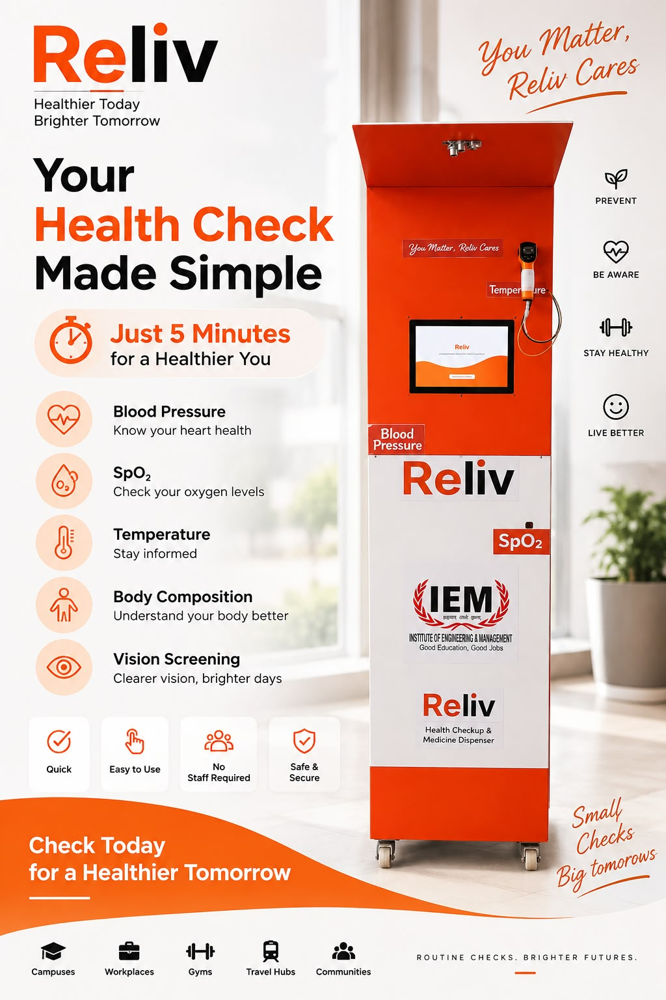

<div align="center">

# RELiV

### Healthcare, now closer to you.

**A smart preventive healthcare kiosk for accessible screening, digital wellness insights, reports, and essential medicine dispensing.**

<br/>

[](https://github.com/Vaibhavcool4805/Reliv)
[](https://github.com/Vaibhavcool4805/Reliv)
[](https://github.com/Vaibhavcool4805/Reliv)
[](https://sih.gov.in/)

<br/>

<a href="https://relivkiosk.vercel.app/"><strong>Explore RELiV</strong></a>
&nbsp;&nbsp;•&nbsp;&nbsp;
<a href="#product-demo"><strong>Watch Demo</strong></a>
&nbsp;&nbsp;•&nbsp;&nbsp;
<a href="#documentation"><strong>Documentation</strong></a>

<br/><br/>



<br/>

*Physical RELiV kiosk — deployment-ready prototype.*

</div>

---

## The idea

Healthcare should be available where people already are.

**RELiV** is a preventive healthcare kiosk designed to make routine health screening and essential healthcare services more accessible in campuses, workplaces, gyms, and community spaces.

It combines a physical kiosk, local computing, sensor integration, a touch interface, wellness-report generation, digital payments, and a medicine-dispensing workflow into one guided experience.

> **You matter. RELiV cares.**

## Submission checklist

- [x] [Team details](#team-details)
- [x] [College/Incubator information](#college-incubator-information)
- [x] [Project title](#project-title)
- [x] [Problem statement](#problem-statement)
- [x] [Healthcare use case](#healthcare-use-case)
- [x] [Technical stack](#technical-stack)
- [x] [AI/ML model or framework details](#aiml-model-or-framework-details)
- [x] [Demo video](#demo-video)
- [x] [Open-source license details](#open-source-license-details)
- [x] [Architecture diagram](#architecture-diagram)
- [x] [Presentation](#presentation)
- [x] [Public accessibility](#public-accessibility)

## Team details

**Team:** Reliv Care Technologies

**Project origin:** Developed and demonstrated from the IEM Gurukul Sector V Hub, Kolkata, West Bengal, India.

**Website positioning:** Reliv is positioned as a preventive healthcare startup/platform focused on self-service screening in everyday public environments.

**Recognition:** Startup India certified, DPIIT recognized, and associated with the Smart India Hackathon 2026 ecosystem.

## College/Incubator information

- **Current public location:** IEM Gurukul Sector V Hub, Kolkata
- **Institutional framing:** The website presents RELiV as a practical campus, workplace, and community health solution.
- **Recognition ecosystem:** Startup India Certified and DPIIT Recognized signals support for early-stage innovation and deployment readiness.

## Project title

**RELiV Smart Health Kiosk**

## Problem statement

Lifestyle conditions such as hypertension, cardiovascular anomalies, and metabolic imbalances often develop silently without clear symptoms. Traditional diagnostics usually require appointment scheduling, travel, waiting times, and laboratory reports. RELiV solves this by placing smart, non-invasive health stations in everyday environments such as colleges, offices, gyms, and public hubs.

## Healthcare use case

RELiV offers a self-service health kiosk for:

- blood pressure monitoring
- pulse oximetry (SpO₂)
- pulse rate and temperature checks
- body composition and body metrics
- digital wellness summary generation with QR-based mobile access
- multilingual support in English, Hindi, and Bengali

The website describes the kiosk as a 3-minute preventive screening experience.

## Technical stack

**Hardware and device stack:**

- Raspberry Pi 5
- ESP32 / ESP32-S3
- BLE, UART, MQTT communication
- offline-first kiosk + smartphone bridge model

**Software and application stack:**

- React for the front-end experience
- Node.js + Express for backend logic
- Python for device processing and local operations
- SQLite for local data storage

**Functional stack:**

- biometric and health-sensor workflows
- digital report generation
- QR access and mobile wellness summary delivery
- payment verification + dispensing flow

## AI/ML model or framework details

The repository includes an AI/ML framework details PDF for the project:

- [Open source and AI/ML framework details PDF](./open%20source%20and%20aiml%20frame%20work%20details.pdf)

The public interface also references digital wellness intelligence, multilingual interaction, and guided health summaries, which are part of the kiosk's intelligent health-report workflow.

## Demo video

**Watch the RELiV demo video:**

- [Public demo video](https://drive.google.com/file/d/1pCtbxVz6lWboECqmcMG6Bz_8ShGW6iFj/view?usp=sharing)

## Open-source license details

- [LICENSE](./LICENSE)

## Architecture diagram

- [Public architecture / presentation PDF](https://drive.google.com/file/d/1ZPd1Oe96mEcPlWhB_8Kcii7WlnUrwtxs/view?usp=sharing)
- [System architecture documentation](docs/architecture/system-architecture.md)

## Presentation

- [SIH presentation hub](docs/presentation/README.md)
- [Project overview and context](docs/presentation/README.md)

## Public accessibility

All listed materials are public-facing and accessible without special permissions. The website, Google Drive clips, sample reports, and repository assets are all intended to be viewable directly without gated access.

## Website-derived product and company details

The public website organizes the product under the following sections:

| Website section | Purpose | Public link |
|---|---|---|
| Product | Health kiosk and health ATM overview | [Health Kiosk](https://relivkiosk.vercel.app/health-kiosk.html) / [Health ATM](https://relivkiosk.vercel.app/health-atm.html) |
| Find Kiosk | Active kiosk location in Kolkata | [Find Kiosk](https://relivkiosk.vercel.app/#find) |
| Solutions | Campus, workplace, and gym deployment use cases | [Organisations](https://relivkiosk.vercel.app/organisations.html) |
| Colleges & Universities | Student and faculty wellness screening | [Colleges](https://relivkiosk.vercel.app/solutions/colleges.html) |
| Workplaces | Corporate office preventive screening | [Workplaces](https://relivkiosk.vercel.app/solutions/offices.html) |
| Fitness Centers | Gym and wellness use case | [Fitness Centers](https://relivkiosk.vercel.app/solutions/gyms.html) |
| About | Mission and problem framing | [About Reliv](https://relivkiosk.vercel.app/about.html) |
| Media | Public and press pages | [Media](https://relivkiosk.vercel.app/media.html) |
| Company / Careers | Opportunities and team ecosystem | [Careers & Internships](https://relivkiosk.vercel.app/careers.html) |
| Contact | Direct contact details | [Email](mailto:relivcustomercare.in@gmail.com) |
| Legal | Privacy, terms, and medical disclaimer | [Privacy Policy](https://relivkiosk.vercel.app/legal/privacy.html) / [Terms of Service](https://relivkiosk.vercel.app/legal/terms.html) / [Medical Disclaimer](https://relivkiosk.vercel.app/legal/disclaimer.html) |
| Social | Instagram and WhatsApp | [WhatsApp](https://wa.me/919163606455) / [Instagram](https://www.instagram.com/reliv_care/) |

## Website summary

From the public website, RELiV is described as a smart, autonomous preventive health kiosk that:

- completes a health check in around 3 minutes
- measures blood pressure, SpO₂, pulse, temperature, and body metrics
- offers multilingual interaction in English, Hindi, and Bengali
- generates instant digital wellness summaries via secure QR-based access
- is designed for colleges, workplaces, gyms, and community hubs
- operates with free assisted screening at the current Kolkata kiosk location

## Why RELiV?

| Accessible | Local-first | Digital | Modular |
|---|---|---|---|
| Designed for everyday locations where basic screening is convenient | Core kiosk workflows are built around local operation | Reports and receipts support digital delivery | Hardware, firmware, backend and intelligence can evolve independently |

## Product Demo

The physical machine is the clearest way to understand RELiV.

**[Watch the full RELiV machine demonstration →](https://drive.google.com/file/d/1P1BW-T57UvRlH1Z3W7Fd4589EpWNdnWm/view?usp=drive_link)**

A copy of the demo video is also available in [`assets/demo/`](assets/demo/).

> If the Google Drive video does not open, set its sharing permission to **Anyone with the link → Viewer**.

## What RELiV brings together

| Health Screening | Wellness Intelligence | Digital Reports | Essential Dispensing |
|---|---|---|---|
| BP, pulse, SpO₂, temperature and body metrics workflow | Plain-language wellness insights and summaries | QR/email-ready digital report experience | Payment-verified purchase and dispensing workflow |

### The patient journey

```text
Patient
   │
   ▼
┌──────────────────┐
│   RELiV KIOSK    │
│  Guided Touch UI │
└────────┬─────────┘
         │
    ┌────┴─────┐
    ▼          ▼
 Health Scan  Purchase
    │          │
    ▼          ▼
 Wellness    Payment
  Report    Verification
    │          │
    ▼          ▼
 QR / Digital  Dispense
 Delivery      + Receipt
```

## See the product

### Live Website

**[Open the RELiV web experience →](https://relivkiosk.vercel.app/)**

### Product Poster



## Product Gallery

The repository uses real RELiV prototype and product assets.

| Physical Prototype | Health Report | Digital Receipt |
|---|---|---|
| [View machine](assets/gallery/Machine.jpeg) | [View report](docs/reports/health-report.md) | [View receipt](docs/reports/receipt.md) |

## Health report experience

RELiV turns a screening session into a structured digital wellness report containing:

- Vital signs overview
- Body-composition metrics
- Wellness analysis and summary cards
- Progress-oriented insights
- 7-day wellness journey
- QR-based report access

**[Explore the sample health report →](docs/reports/health-report.md)**

## Payment & dispensing

The dispensing workflow is designed around verified payment before fulfillment:

```text
Select item → Online payment → Server verification
       → Signed authorization → Kiosk verification
       → Dispense + Receipt
```

The product workflow includes session binding, expiry validation, one-use authorization and replay protection.

**[Explore the product workflow →](docs/architecture/product-workflow.md)**

## Technical Architecture

RELiV follows an **offline-first kiosk + phone bridge** concept.

```text
                         RELiV KIOSK
┌──────────────────────────────────────────────────────────────┐
│                                                              │
│   Touch UI          Raspberry Pi 5           SQLite          │
│   React       ───►  Local API / Logic  ───►  Local Data     │
│                          │                                   │
│             ┌────────────┴────────────┐                      │
│             ▼                         ▼                      │
│       ESP32-S3 / Sensors        ESP32 / Dispenser           │
│       BLE • UART                MQTT / Local messaging      │
│                                                              │
└──────────────────────────┬───────────────────────────────────┘
                           │ Local Wi-Fi
                           ▼
                    CUSTOMER PHONE
                           │
                  Mobile Internet Bridge
                           │
             ┌─────────────┴─────────────┐
             ▼                           ▼
       Payment Verification        Deferred Delivery
             │                           │
             ▼                           ▼
          Razorpay                  Report / QR flow
```

### Technology Stack

| Layer | Technology |
|---|---|
| Kiosk controller | Raspberry Pi 5 (4 GB) |
| Microcontrollers | ESP32 / ESP32-S3 |
| Frontend | React |
| Backend | Node.js + Express |
| Device processing | Python |
| Database | SQLite |
| Communication | BLE · UART · MQTT |
| Payments | Razorpay verification flow |
| Deployment model | Local kiosk + web/cloud components |

**Core technologies:**


## Security & reliability

RELiV is designed with failure-aware fulfillment and local resilience in mind.

- Session-bound authorization
- Signed payment responses
- One-use authorization consumption
- Expiry validation and replay protection
- Durable local logs
- Retry-safe fulfillment
- No secrets committed to the repository
- Local operation for core kiosk functions

## Deployment-ready prototype

The RELiV prototype is **fully assembled and ready for deployment in suitable supervised environments**.

| Area | Status |
|---|---|
| Physical kiosk | Ready |
| Touch UI | Ready |
| Local backend | Ready |
| Health screening workflow | Ready |
| Digital health report | Ready |
| Inventory/admin workflow | Ready |
| Payment + dispensing flow | Ready |
| Device communication | Ready |
| Deployment | Ready |

Field-specific validation, calibration, operational monitoring, and regulatory or permission requirements can continue alongside deployment.

## Deployment opportunities

**Campuses** — routine wellness checks for students and staff.

**Workplaces** — accessible wellness stations in offices and institutions.

**Gyms & fitness spaces** — convenient measurements alongside regular fitness activity.

**Community locations** — a modular platform for broader preventive-health access.

## Recognition

**1st Runner-Up — Investopia, Bengal E-Summit 2026**

Recognized at IEM Gurukul, Kolkata, on 29–30 August 2026.

RELiV is also being developed under the **Student Innovation / Hardware** framing for Smart India Hackathon 2026.

## Documentation

| Resource | Description |
|---|---|
| [Submission Summary](docs/submission/README.md) | Public project checklist and links |
| [SIH Presentation Hub](docs/presentation/README.md) | Project presentation and context |
| [Sample Health Report](docs/reports/health-report.md) | Demonstration wellness report |
| [Sample Receipt](docs/reports/receipt.md) | Demonstration digital purchase receipt |
| [System Architecture](docs/architecture/system-architecture.md) | Architecture and data-flow notes |
| [Product Workflow](docs/architecture/product-workflow.md) | Patient and dispensing journeys |

## Repository Structure

```text
Reliv/
├── README.md
├── LICENSE
├── SECURITY.md
├── CONTRIBUTING.md
├── CHANGELOG.md
│
├── assets/
│   ├── demo/
│   ├── gallery/
│   └── screenshots/
│
├── docs/
│   ├── architecture/
│   ├── presentation/
│   ├── reports/
│   └── submission/
│
└── .github/
    └── ISSUE_TEMPLATE/
```

Application source modules can be added under their respective frontend, backend, hardware, AI, and firmware directories as the implementation is published.

## Roadmap

### Next stage

- [ ] Supervised field deployment
- [ ] Reference-device comparison and calibration documentation
- [ ] Pilot usability measurements
- [ ] Operational monitoring and maintenance workflow
- [ ] Broader institutional deployment

## Responsible Use

RELiV is a preventive-health and wellness platform. Screening outputs and generated summaries are not a substitute for professional medical diagnosis, treatment, or emergency care.

Clinical validation, calibration, applicable regulatory or permission requirements, privacy controls, safe medicine-handling procedures, and supervised operational practices should be maintained for real-world deployment.

Sample documents should use anonymized or synthetic information before public distribution.

## Contributing

Technical improvements, hardware integration work, UX feedback, testing strategies and documentation improvements are welcome.

See [CONTRIBUTING.md](CONTRIBUTING.md) for the contribution workflow.

## License

See [LICENSE](LICENSE).

---

<div align="center">

## RELiV

### Preventive healthcare, closer to everyday life.

[Explore RELiV](https://relivkiosk.vercel.app/) · [Watch the Demo](https://drive.google.com/file/d/1P1BW-T57UvRlH1Z3W7Fd4589EpWNdnWm/view?usp=drive_link) · [View Repository](https://github.com/Vaibhavcool4805/Reliv)

**You matter. RELiV cares.**

</div>
